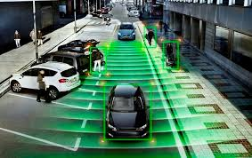

# **Autonomous Vehicle Projects**

---
Overview
---
The repo contains autonomous vehicle projects.

---
List of projects
---

### [Self-Driving Car Engineer Nanodegree Projects](https://www.udacity.com/course/self-driving-car-engineer-nanodegree--nd013) 

* Project 0 - [Finding Lane Lines](https://github.com/tranlyvu/autonomous-vehicle-projects/tree/master/Finding%20Lane%20Lines): Detect lane lines in images - [Notebook](http://nbviewer.jupyter.org/gist/tranlyvu/df59fa9ea4a18f373947ca5c04bec801).

* Project 1 - [Traffic Sign Recognition Classifier](https://github.com/tranlyvu/autonomous-vehicle-projects/tree/master/Traffic%20Sign%20Classifier): Classify traffic signs using deep learning - [Notebook](http://nbviewer.jupyter.org/gist/tranlyvu/83ae4a2ef68908f33b3c4f3d11b1e374).

* Project 2 - [Behavior Cloning](https://github.com/tranlyvu/autonomous-vehicle-projects/tree/master/Behavior%20Cloning): Clone driving behavior - [Notebook](http://nbviewer.jupyter.org/gist/tranlyvu/671c4e258dcc5535f27e458e346c64e9).

* Project 3 - [Advanced Lane Lines Finding](https://github.com/tranlyvu/autonomous-vehicle-projects/tree/master/Advanced%20Lane%20Lines): Identify the lane boundaries in a video - [Notebook](http://nbviewer.jupyter.org/gist/tranlyvu/ffb64be864e9b67cc2aa273d34df8b45).

* Project 4 - [Vehicle Detection and Tracking](https://github.com/tranlyvu/autonomous-vehicle-projects/tree/master/Vehicle%20Detection): Detect vehicles in a video - [Notebook](http://nbviewer.jupyter.org/gist/tranlyvu/3f15440e66a89c1b50bb4993878d1390).

---
Development Environment
---

In order to set up development environment to run all projects, follow instruction [here](https://github.com/tranlyvu/autonomous-vehicle-projects/tree/master/env).

---
Contribution
---

Contributions are welcome! For bug reports or requests please submit an [issue](https://github.com/tranlyvu/autonomous-vehicle-projects/issues).

---
Contact-info
---

Feel free to contact me to discuss any issues, questions, or comments.
*  Email: vutransingapore@gmail.com
*  Twitter: [@vutransingapore](https://twitter.com/vutransingapore)
*  GitHub: [Tran Ly Vu](https://github.com/tranlyvu)

---
License
---
See the [LICENSE](https://github.com/tranlyvu/autonomous-vehicle-projects/blob/master/LICENSE) file for license rights and limitations (Apache License 2.0).