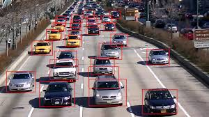

# **Vehicle Detection**



---
Overview
---

In this project, we created a vehicle detection and tracking pipeline with OpenCV, histogram of oriented gradients (HOG), and support vector machines (SVM), optimizing and evaluating the model on video data from an automotive camera taken during highway driving (start with the test_video.mp4 and later implement on full project_video.mp4).

The goals / steps of this project are the following:

* Perform a Histogram of Oriented Gradients (HOG) feature extraction on a labeled training set of images and train a classifier Linear SVM classifier
* Optionally, you can also apply a color transform and append binned color features, as well as histograms of color, to your HOG feature vector. 
* Note: for those first two steps don't forget to normalize your features and randomize a selection for training and testing.
* Implement a sliding-window technique and use your trained classifier to search for vehicles in images.
* Run your pipeline on a video stream (start with the test_video.mp4 and later implement on full project_video.mp4) and create a heat map of recurring detections frame by frame to reject outliers and follow detected vehicles.
* Estimate a bounding box for vehicles detected.

Here are the [notebook](http://nbviewer.jupyter.org/gist/tranlyvu/3f15440e66a89c1b50bb4993878d1390) and [source code](https://github.com/tranlyvu/autonomous-vehicle-projects/blob/master/Vehicle%20Detection/src/vehicle_detection.py) of this project.

Here is [Youtube link](https://youtu.be/5ArWpcyd7WQ) to video.

---
Project Writeup
---

### Dataset

Dataset was provided by Udacity: Here are links to the labeled data for [vehicle](https://s3.amazonaws.com/udacity-sdc/Vehicle_Tracking/vehicles.zip) and [non-vehicle](https://s3.amazonaws.com/udacity-sdc/Vehicle_Tracking/non-vehicles.zip) 

These example images come from a combination of the [GTI vehicle image database](http://www.gti.ssr.upm.es/data/Vehicle_database.html), the [KITTI vision benchmark suite](http://www.cvlibs.net/datasets/kitti/), and examples extracted from the project video itself.   

There is also recently released [Udacity labeled dataset](https://github.com/udacity/self-driving-car/tree/master/annotations) to augment your training data. However, for this project, I did not use this dataset


#### Histogram of Oriented Gradients (HOG)

I started by reading in all the `vehicle` and `non-vehicle` images.  Here is an example of one of each of the `vehicle` and `non-vehicle` classes:


I then explored different color spaces and different `skimage.hog()` parameters (`orientations`, `pixels_per_cell`, and `cells_per_block`).  I grabbed random images from each of the two classes and displayed them to get a feel for what the `skimage.hog()` output looks like.

 HOG parameters of `orientations=9`, `pixels_per_cell=(8, 8)` and `cells_per_block=(2, 2)`:


I tried various combinations of parameters with trials and errors, I finaly chose to use spatial binning, color histogram and hog features with the following parameters

```
color space : 'YCrCb' 
the number of orientation bins:  9 
pix_per_cell = 8 
cell_per_block = 2 
hog_channel = "ALL" 
spatial_size = (16, 16) 
hist_bins = 16   
```

I trained a linear SVM using the above features and parameters. 

I initially used RGB for color space but 'YCrCb' yielded better result. Number of orientation bins is 9 as it is recommended by original HOG paper. SVM was first recommended by udacity and actually provided good result so i did not tried other models.

I was also normalizing the training data as recommended by Udacyty with sklearn.preprocessing.StandardScaler()

The final test accuracy was 0.99

#### Sliding Window Search

For searching cars in an input image I use sliding window technique that taught by Udacity. It means that I iterate over image area that could contain cars with approximately car sized box and try to classify whether box contain car or not.  I use  sliding window sizes of 96 pixels side size. While iterating I use 50% window overlapping in horizontal and vertical directions. I also decided to search random window positions at random scales from bottom half of the image. Here is a sample of test images:


#### Eliminating False Positive

In order to eliminate overlapping detection and false positive, I recorded the positions of positive detections in each frame of the video.  From the positive detections I created a heatmap and then thresholded that map to identify vehicle positions.  I then used `scipy.ndimage.measurements.label()` to identify individual blobs in the heatmap.  I then assumed each blob corresponded to a vehicle.  I constructed bounding boxes to cover the area of each blob detected.  

Here's an example result showing the heatmap from a series of frames of video, the result of `scipy.ndimage.measurements.label()` and the bounding boxes then overlaid on the last frame of video:


Here the resulting bounding boxes:


---
### Video Implementation

Here is a [repo link](https://github.com/tranlyvu/autonomous-vehicle-projects/blob/master/Vehicle%20Detection/output_videos/project_video.mp4) and [Youtube link](https://youtu.be/5ArWpcyd7WQ) to my video.

---
### Discussion

From my video, there are some redundant boxes although cars have been detected. Here are a few things I could consider doing if i were to have more times: 

```
- Try new classifier, i.e decision tree
- Try to use more data, i.e [Udacity labeled dataset](https://github.com/udacity/self-driving-car/tree/master/annotations)
- Doing more parameters tuning ,etc
```
